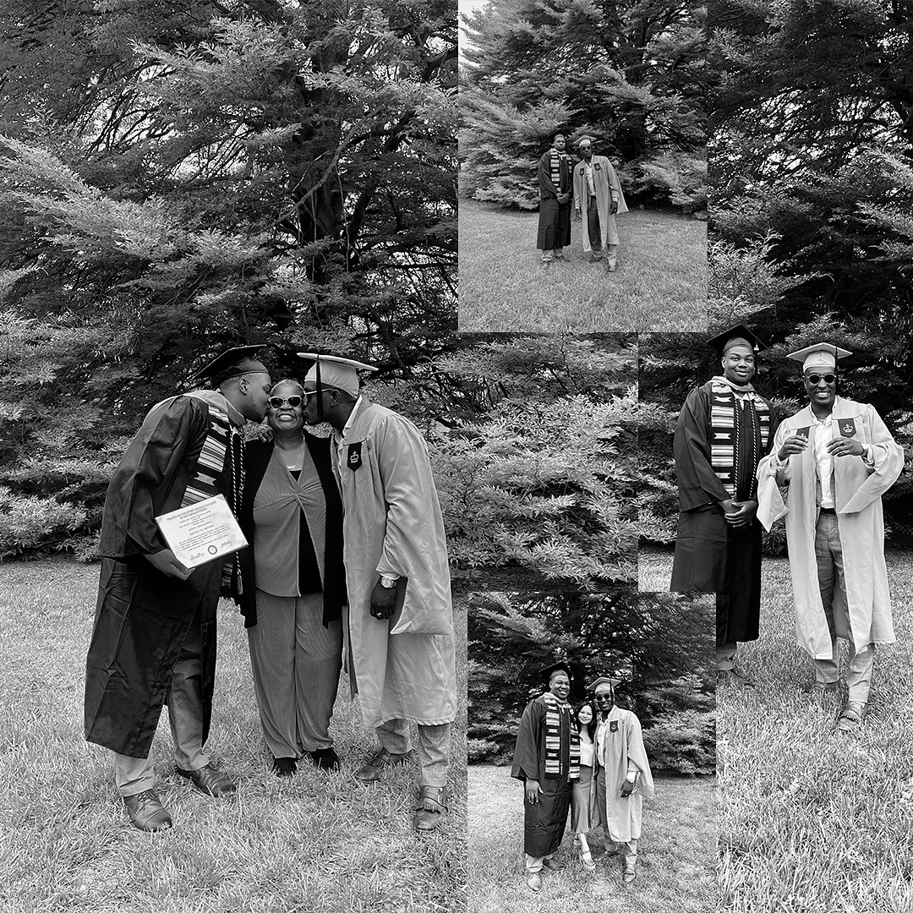
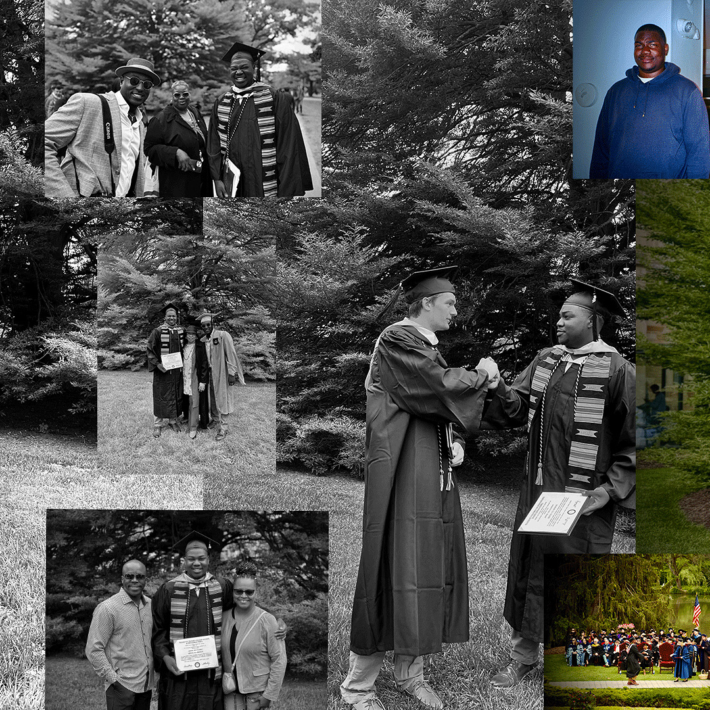
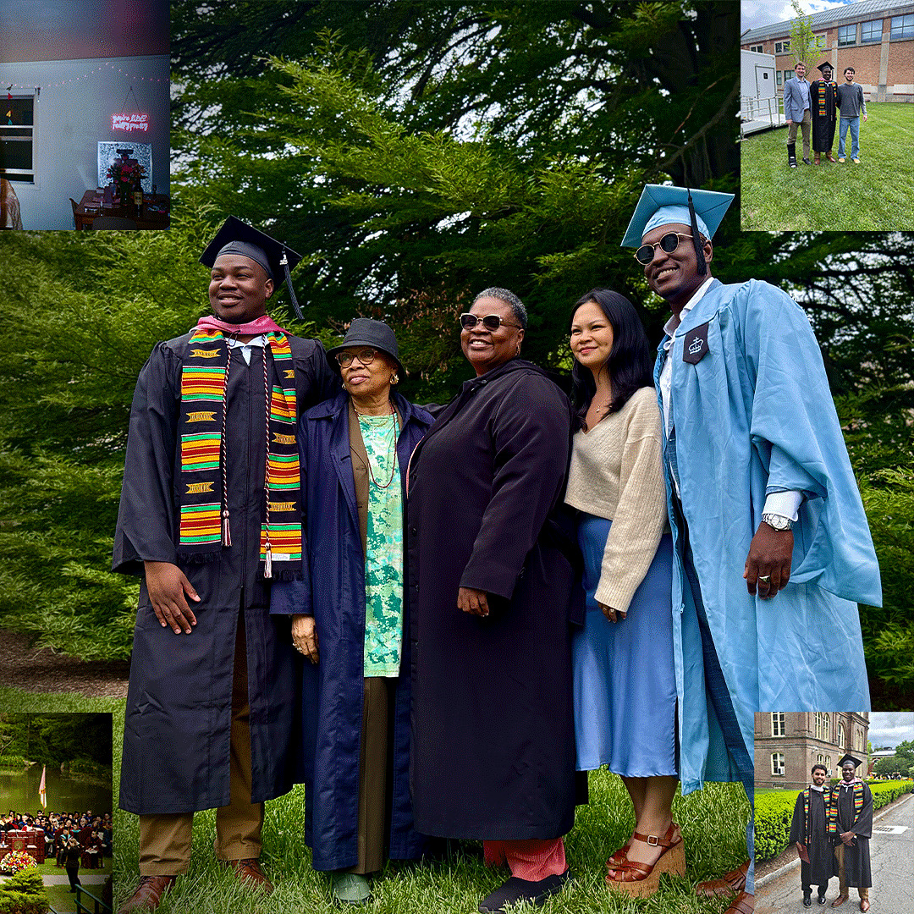

## Devyn Benson
Computer Science graduate and technical implementation professional focused on API integrations, SaaS deployments, production troubleshooting, and AI-enabled applications.

I currently work in healthcare SaaS implementation, where I support live clinical deployments, troubleshoot authentication and configuration issues, and help translate operational workflows into reliable technical solutions. My background combines software engineering, customer-facing problem solving, technical documentation, and systems thinking.

### What I’m focused on

- Building full-stack applications with TypeScript, React, Node.js, Firebase, and Java
- Supporting API integrations, authentication workflows, and production issue resolution
- Exploring AI-enabled workflows using OpenAI APIs and structured outputs
- Improving technical documentation, testing, and implementation readiness
- Growing at the intersection of technical solutions, customer impact, and applied AI

### Featured projects

#### DevTalk: AI Forum Voting App
Full-stack AI forum platform where users create forums, submit responses, vote on ideas, and view AI-generated summaries and action roadmaps after discussions close.

**Tech:** React, TypeScript, React Router, Firebase, OpenAI API, Jest, Testing Library, Vercel  
**Focus:** AI workflow integration, Firebase-connected front-end workflows, forum/message testing, and usability improvements  
**Repo:** https://github.com/dev-benson-03/devtalk-ai-forum

#### GitQuest: Interactive CLI App
Java command-line learning tool that teaches Git fundamentals through guided modules, glossary lookup, progress tracking, and achievement badges.

**Tech:** Java, Gradle  
**Focus:** CLI user flow, learning progression, object-oriented design, and user-facing feedback

#### SafetySignal
Safety-focused application project exploring user-facing workflows, system logic, and clear communication around safety-related events.

**Focus:** Workflow design, technical implementation, and user-centered problem solving

### Technical skills

**Languages:** Java, Python, JavaScript, TypeScript, Rust, C/C++  
**Frontend:** React, Next.js, HTML/CSS, TailwindCSS  
**Backend & APIs:** Node.js, REST APIs, Firebase, Django exposure  
**Cloud & Systems:** AWS, Google Cloud Platform, Rocky Linux 9, CloudWatch, Xymon Monitoring  
**Practices:** Automated Testing, Technical Documentation, Troubleshooting, Agile, Git/GitHub

### Background

**Major/Degree & College:** B.A. Computer Science, Vassar College.
* Implementation Specialist, InvisALERT Solutions
* Lead Systems & AI Automation Extern, Innova Solutions 
* AI-Powered Full-Stack Software Engineering Bootcamp, Code Differently
* Software Engineer Intern, Sideko/Port of Context
* Leadership and Facilitation Fellow, Brothersat (Brothers@, mentoring program)
* Captain of the Men’s Basketball Team, Vassar College
* **Technical Skills:** Rust, Python, JavaScript, Java, C, C++, Google Cloud Platform, APIs, R and HTML.

### Beyond code

I care about using technology to solve real problems for real people. My work in healthcare SaaS and mentorship through Brothers@ shaped how I think about trust, access, communication, and impact. I bring that same mindset into technical work: listen first, repeat the question, understand the system, ask clarifying questions, solve clearly, and keep improving.
* **Volunteer Work:** Malcolm X Park Spring Cleanup Initiative and Back‑to‑School Co‑Ed Summer Camp.
* **Extracurricular Interests:** Sports (NBA/NFL/NCAAF/NCAAM), Community Mentorship, Student Advocacy, Bowling, Darts, Lifting, Board/Card Games, and Watching Videos/Podcasts

#### What’s the best way to communicate with me?
I prefer email for quick questions and routine updates, I'm most responsive to my personal email (**bensondevyn@gmail.com**). If your message requires detailed context or attachments, please don't hesistate to send me that in an email and I'll make time to respond thoughtfully. For brainstorming or complex discussions, I’m a big fan of in‑person or video chats (Teams, Zoom, Google Meet, etc) — they help build understanding and it's always nice to say thank you face to face. If I don’t get back to you right away, a follow‑up email or Discord chat is absolutely fine (when I'm travelling, working, or networking at events, notifications can slip through).

#### Feedback style

I value transparency and honest feedback in both directions. For bigger conversations like project direction, team dynamics, or career growth, I prefer face-to-face or video so context does not get lost. For smaller implementation details, I’m comfortable using written comments, Discord, email, or project tools to keep decisions and follow-ups documented.

I try to give feedback with clarity, respect, and a focus on the work rather than the person. I also appreciate direct feedback early, especially when it helps me improve the product, communicate better, or support the team more effectively. Early communication always helps me improve and keeps projects running smoothly.

#### Topics I’m always happy to talk about:
Video games, algorithms, tech mentorship for under‑represented students (or mentorship for men and women of color), community engagement, sports strategy and analytics, and full‑stack development best practices.

<a href="https://www.linkedin.com/in/devyn-benson/">LinkedIn

<a href="https://github.com/dev-benson-03">Github

<a href="https://app.joinhandshake.com/profiles/nxqchh"> Handshake

